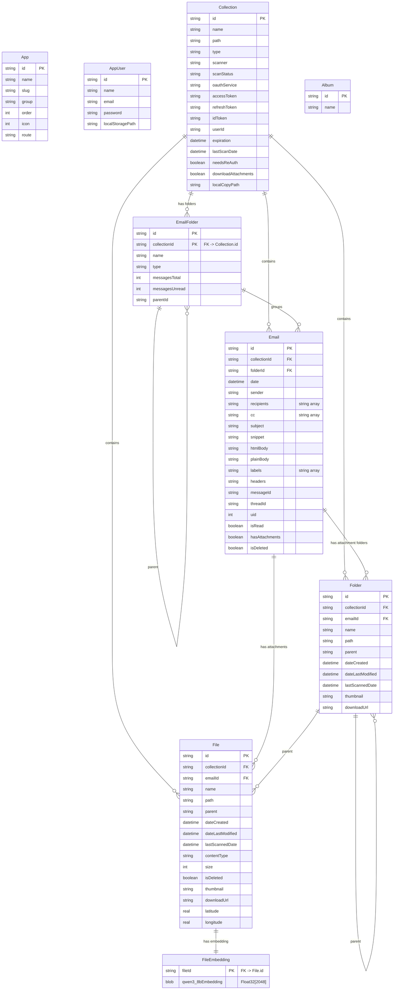
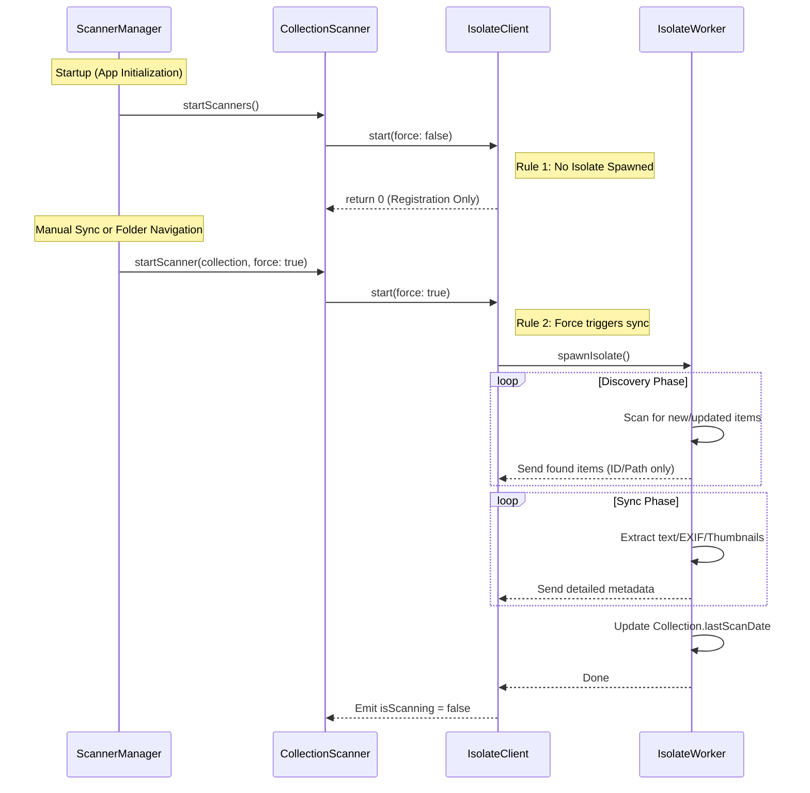

## Overview

**MyData/Tools** is a privacy-focused, local-first Digital Asset Manager (DAM) for managing your digital life — files, emails, photos, and social media archives — all stored on your device with no cloud dependency.

- **Local-first**: All data stored on your device
- **Privacy-focused**: Zero server-side data storage
- **Cross-platform**: Windows, macOS, and Linux support
- **AI-powered search**: Local LLM integration for semantic search and document understanding

---

## Architecture

The app is a hybrid Flutter + Python application:

| Layer | Technology | Purpose |
|-------|-----------|---------|
| UI | Flutter (Dart) | Cross-platform desktop UI |
| Data | SQLite + Drift ORM | Local metadata & vector storage |
| AI | Python FastAPI | Local LLM inference & semantic search |
| Background | Dart Isolates | Parallel file scanning & processing |

### Startup Sequence

```
1. Initialize Flutter bindings & MediaKit
2. Initialize window manager (desktop)
3. Check database configuration
   → If not configured: show Setup page
   → If configured: proceed
4. Initialize DatabaseManager (SQLite + Drift ORM)
5. Initialize PythonManager (start AI Chat service)
6. Show splash screen → Main app
7. AppRouter redirects based on auth state
   → Not logged in → Login page
   → Logged in → Home page
```

### Data Flow (File Collection Example)

```
User adds collection
  → Source detected (local/Google Drive)
  → OAuth flow (if cloud source)
  → Collection saved to database
  → ScannerManager registers scanner
    → LocalFileIsolate/GoogleFileScanner spawns background Isolate
    → Files scanned, metadata extracted (EXIF, thumbnails)
    → FileRepository upserts to SQLite
    → DatabaseChangeWatcher notifies UI
  → RxFilesPage observes DB change stream and updates
```

---

## Directory Structure

```
/client/
  lib/
    modules/       # Feature modules (files, email, photos, aichat, social)
    repositories/  # Data access layer
    services/      # Core business logic
    pages/         # Top-level pages (Home, Login, Setup, Splash)
    models/tables/ # Database schema (Drift ORM)
    scanners/      # Collection scanner orchestration
    file_sources/  # Source providers (Local, Google Drive)
    oauth/         # OAuth authentication
    widgets/       # Reusable UI components
    l10n/          # Localization/i18n
  assets/
/aiserver/         # Python FastAPI LLM service
/models/           # Downloaded ML models (GGUF)
/services/         # Cloud deployment configs (Google Cloud Run)
```

---

## Collection Modules

### Files (`/modules/files`)
Browse and scan local filesystem and Google Drive. Extracts EXIF metadata, generates thumbnails, and supports embedding-based semantic search.

- Scanners: `local_file_isolate.dart`, `google_file_scanner.dart`
- Services: `get_files_and_folders_service`, `file_upsert_service`, `embedding_isolate`
- Utilities: EXIF extractor, thumbnail generator

### Email (`/modules/email`)
Archives and searches email from multiple providers. Supports Gmail, Yahoo, and Outlook PST files.

- Scanners: `gmail_scanner.dart`, `yahoo_scanner.dart`, `outlook_pst_scanner_isolate.dart`

### Social (`/modules/social`)
Social media archive support for Facebook, Twitter, and Instagram. (In progress)

---

## Tools


### Photos (`/modules/photos`)
Photo gallery with timeline view, GPS/EXIF data display, and full-text search.

### AI Chat (`/modules/aichat`)
Semantic search across all collected data via a local LLM. Communicates with the bundled Python FastAPI service.

- Model: Gemma 3.4B (GGUF), SigLip2 embeddings
- Libraries: LangChain, llama-cpp-python

---

## State Management

The app uses **RxDart 0.28** for reactive state. There is no Provider, Bloc, or Riverpod — the architecture is built entirely on RxDart streams and singletons.

### Core Pattern: `RxService<C, R>`

All services extend a generic base class at `lib/services/rx_service.dart`:

```dart
class RxService<C, R> {
  late BehaviorSubject<C> _source;      // input command
  late BehaviorSubject<R> _sink;        // output result
  late BehaviorSubject<bool> _isLoading;

  Future<R> invoke(C command) async => throw UnimplementedError();
}
```

UI calls `invoke(command)` → service does work → emits to `sink` → pages call `setState()` on the stream value. All services are singletons accessed via `Service.instance`.

### Subject Types

| Type | Used For |
|------|----------|
| `BehaviorSubject` | State that new subscribers need immediately (replays last value) |
| `PublishSubject` | One-time events (selection changes, navigation) |

### Global App State

Static `BehaviorSubject`s on `MainApp` (`main.dart:44-54`) hold app-wide state accessible anywhere:

```dart
static final BehaviorSubject<Directory?> supportDirectory = BehaviorSubject();
static final BehaviorSubject<String?> appDataDirectory = BehaviorSubject();
static final BehaviorSubject<String?> llmServiceUrl = BehaviorSubject();
```

### Page-Level State

Pages hold static subjects for cross-widget communication. Example from `rx_files_page.dart`:

```dart
static PublishSubject selectedCollection = PublishSubject();
static BehaviorSubject<String> sortColumn = BehaviorSubject.seeded("name");
static BehaviorSubject<bool> sortDirection = BehaviorSubject.seeded(true);
```

### Stream Subscription Pattern

Pages subscribe in `initState` and always cancel in `dispose`:

```dart
// initState
_fileServiceSub = _filesAndFoldersService!.sink.listen((value) {
  setState(() => filesAndFolders = value);
});

// dispose
_fileServiceSub?.cancel();
```

A **post-frame callback** is used when invoking services from `initState` to prevent `BehaviorSubject` from replaying its last value synchronously, which would cascade `setState` calls before the first frame renders:

```dart
WidgetsBinding.instance.addPostFrameCallback((_) {
  _collectionService!.invoke(GetCollectionsServiceCommand(null));
});
```

### Background Scan → UI Update Flow

The files and email services use a **cache-then-scan** pattern:

```
1. Service queries DB immediately → emits cached results → UI renders
2. Background scanner starts (fire-and-forget)
3. Page subscribes to scanner.isScanning (BehaviorSubject<bool>)
4. When scanner transitions true → false, page re-invokes service for silent refresh
```

### Widget-Tree Communication: Notifications

Child widgets bubble events up using Flutter's `Notification` class (not RxDart), defined in `modules/files/notifications/`:

- `PathChangedNotification` — user navigated into a folder
- `SortChangedNotification` — column sort changed
- `FileDeletedNotification` — file was deleted
- `SelectionChangedNotification` — multi-select changed

Parent pages wrap tables in `NotificationListener<FiledNotification>` and handle each type.

### Logging Stream

`AppLogger` (`app_logger.dart:154`) broadcasts status messages via a static `PublishSubject<String> statusSubject`. In isolates it sends over a `SendPort`; in the main isolate it publishes directly to the subject.

### Summary

| Aspect | Pattern |
|--------|---------|
| Global state | Static `BehaviorSubject` on `MainApp` |
| Service I/O | `RxService<C,R>` with source/sink/isLoading subjects |
| Service discovery | Singletons (`Service.instance`) |
| Page state | Static subjects on each page widget |
| UI updates | `.listen()` → `setState()` |
| Background scan → UI | `scanner.isScanning` stream, refresh on complete |
| Child → parent events | Flutter `Notification` class (bubbling) |
| Error handling | Try/catch in `invoke()`, no dedicated error stream |
| Cleanup | `subscription.cancel()` in every `dispose()` |

---

## Technology Stack

**Frontend:**
- Flutter 3.7+ / Dart 3.7+
- Material Design 3
- GoRouter (navigation)
- Drift ORM
- Reactive Forms & Form Builder

**AI/Backend:**
- Python 3.11+
- FastAPI + Uvicorn
- LangChain (LLM orchestration)
- llama-cpp-python (local inference)
- PyInstaller (executable bundling)

**Database:**
- SQLite3
- sqlite_vector (vector embeddings)
- Drift (code generation ORM)

**Cloud/External:**
- Google APIs (Drive, Gmail, Sign-In)
- OAuth2 authentication
- HuggingFace Hub (model downloads)

---

## Database Structure

The database is a SQLite database managed by Drift ORM, with sqlite_vector extension for semantic embeddings.

### Table Diagrams

Schema version: 12



---

## Scanner Architecture

The application uses a standardized, multi-layered scanner architecture to asynchronously discover and synchronize data from various sources (Local Files, Google Drive, Email IMAP, PST Files). To ensure a fast and responsive startup experience, all scanners must strictly follow the **"Registration-Only Startup"** rule.

### Scanner Lifecycle

All scanners implement a lifecycle that separates the "Discovery" of items (folders, files, emails) from the "Sync" of their full content (metadata extraction, thumbnail generation, body parsing).



### The 5 Synchronization Rules

To maintain parity across all scanners (File, Email, Social), every scanner implementation MUST adhere to these rules:

| Rule | Name | Behavior |
|------|------|----------|
| **Rule 1** | **Registration-Only Startup** | `ScannerManager.startScanners()` must only register scanners in the internal map. It must NEVER trigger a background scan automatically on startup. |
| **Rule 2** | **Force Safety Gate** | The scanner's `start()` method must return immediately if `force` is `false`. No isolates should be spawned, and no API connections should be opened unless `force: true` is passed. |
| **Rule 3** | **Manual Sync Explicitly Forces** | When a user clicks "Sync Collection," the app must call `start(force: true)`, bypassing the startup safety gate. |
| **Rule 4** | **Discovery vs. Sync** | Scanners should ideally discover items first (to update the UI quickly) and then perform heavy extraction (thumbnails, embeddings) in a secondary background pass or incrementally. |
| **Rule 5** | **Targeted Scanning vs. Full Sync** | Scanners MUST support both full collection syncs (`path == null`) and targeted folder scans (`path != null`) to provide immediate UI feedback during navigation. |

### Scanning Modes: Targeted vs. Full Sync

All scanners MUST implement two distinct operation modes based on the `path` parameter:

1.  **Full Collection Synchronization (`path == null`)**:
    *   **Behavior**: Recursively traverses the entire collection (e.g., all Gmail folders, all local files in a multi-Gigabyte directory).
    *   **Goal**: Ensure the local database is perfectly in sync with the source.
    *   **State**: Updates the `Collection.lastScanDate` upon successful completion.

2.  **Targeted Folder Scan (`path != null`)**:
    *   **Behavior**: Focuses exclusively on the specified directory or folder ID.
    *   **Goal**: Provide near-instantaneous UI updates when a user navigates into a specific folder.
    *   **Optimization**: This mode is often invoked with `force: true` by the UI during navigation, even if a full sync is not yet complete.

### Building a New Scanner (LLM Guide)

When creating a new scanner (e.g., `SocialScanner`), follow these implementation requirements:

1.  **Inherit/Implement:** Must implement the `CollectionScanner` interface.
2.  **Isolate Client:** Create a client class (e.g., `SocialScannerIsolate`) that handles the `spawnIsolate` logic.
3.  **Rule 2 Implementation:** In the `start()` method of your client:
    ```dart
    Future<void> start(Collection collection, {bool force = false}) async {
      if (!force) {
        logger.i("Registration-only mode: skipping scan for ${collection.name}");
        return;
      }
      // ... Proceed with spawning isolate ...
    }
    ```
4.  **Null-Safe Isolates:** Use null-aware access for the isolate reference (`_isolate?.addOnExitListener`) to support unit testing with mock isolates.
5.  **Status Reporting:** Use the `statusPort` to communicate progress back to the main isolate, updating `isScanning` and triggering UI refreshes.
