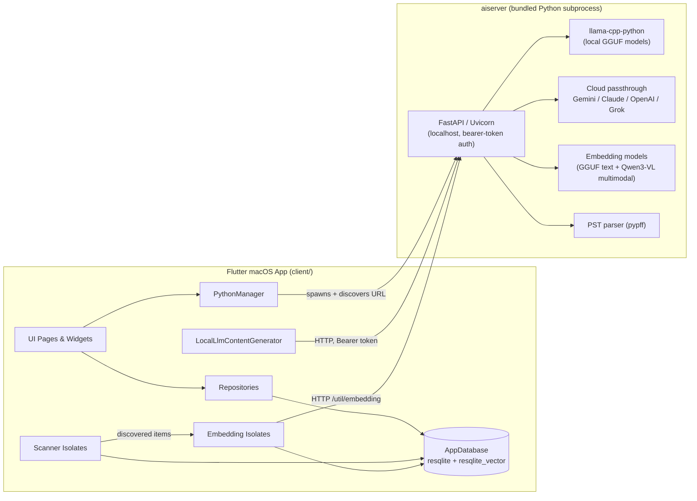
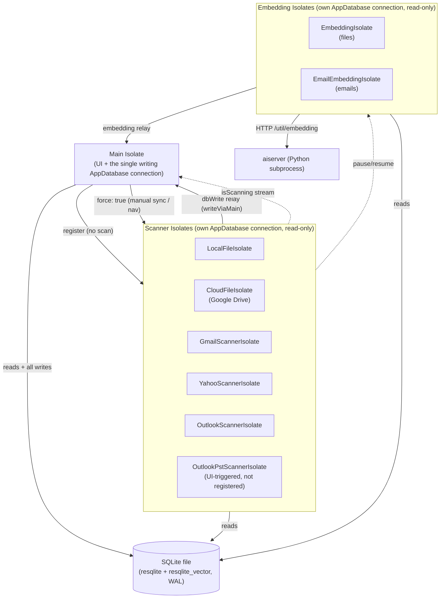
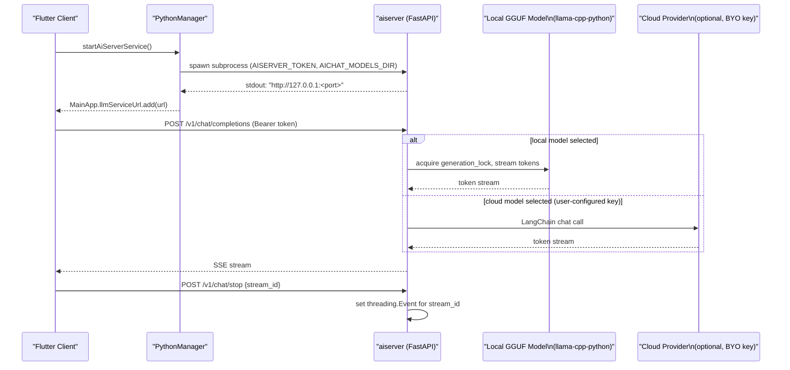
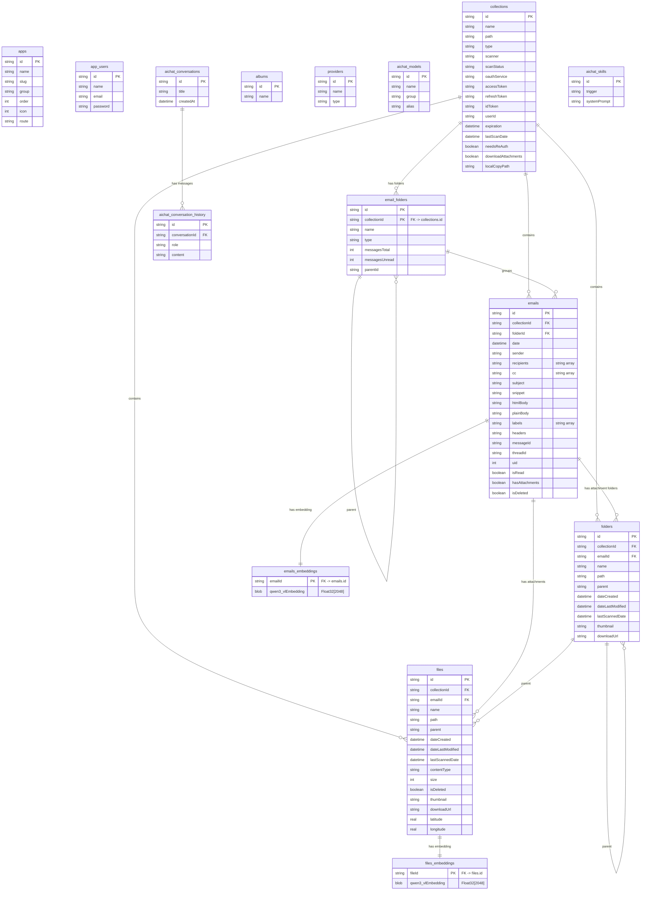
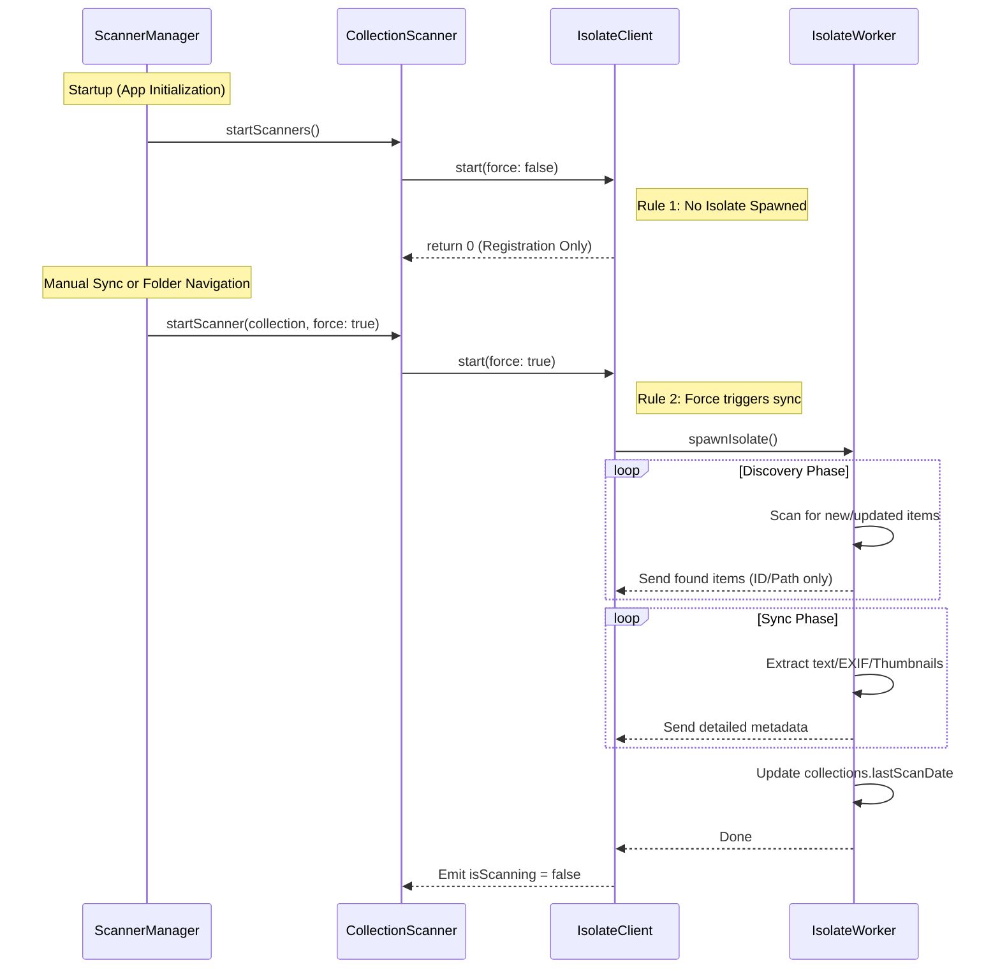

## Overview

**My Data Studio** is a privacy-focused, local-first Digital Asset Manager (DAM) for managing your digital life — files, emails, photos, and social media archives — all stored on your device with no cloud dependency required for AI features.

- **Local-first**: All data stored on your device
- **Privacy-focused**: Zero server-side data storage in My Data Studio's own services (an optional, user-configured cloud model provider is a separate case — see below)
- **Cross-platform**: Windows, macOS, and Linux support (current release targets macOS)
- **AI-powered search**: Local LLM integration for semantic search and document understanding, with optional cloud model passthrough (Gemini/Claude/OpenAI/Grok) **if the user supplies their own API key**

---

## Architecture

The app is a hybrid Flutter + Python application. The Python service is not a separate deployment — it's bundled inside the Flutter app and spawned as a child process on launch.

| Layer | Technology | Purpose |
|-------|-----------|---------|
| UI | Flutter (Dart) | Cross-platform desktop UI |
| Data | SQLite via **resqlite** + **resqlite_vector** | Local metadata & vector storage (hand-written schema, no ORM codegen) |
| AI | Python FastAPI (bundled subprocess) | Local LLM inference, embeddings, PST parsing |
| Background | Dart Isolates | Parallel file/email scanning, embedding generation |
| State | RxDart (`BehaviorSubject`/`PublishSubject`) | App-wide and page-level reactive state — no Provider/Bloc/Riverpod |


```mermaid
flowchart LR
    subgraph Flutter["Flutter macOS App (client/)"]
        UI["UI Pages & Widgets"]
        Repo["Repositories"]
        DB[("AppDatabase\nresqlite + resqlite_vector")]
        Scanners["Scanner Isolates"]
        EmbIso["Embedding Isolates"]
        PM["PythonManager"]
        LLMGen["LocalLlmContentGenerator"]
    end

    subgraph Python["aiserver (bundled Python subprocess)"]
        FastAPI["FastAPI / Uvicorn\n(localhost, bearer-token auth)"]
        Local["llama-cpp-python\n(local GGUF models)"]
        Cloud["Cloud passthrough\nGemini / Claude / OpenAI / Grok"]
        Embed["Embedding models\n(GGUF text + Qwen3-VL multimodal)"]
        PST["PST parser (pypff)"]
    end

    UI --> Repo --> DB
    Scanners --> DB
    EmbIso --> DB
    Scanners -->|"discovered items"| EmbIso
    UI --> PM
    PM -->|"spawns + discovers URL"| FastAPI
    LLMGen -->|"HTTP, Bearer token"| FastAPI
    EmbIso -->|"HTTP /util/embedding"| FastAPI
    FastAPI --> Local
    FastAPI --> Cloud
    FastAPI --> Embed
    FastAPI --> PST
```

### Startup Sequence

```
1. Initialize Flutter bindings & MediaKit
2. Initialize window manager (desktop)
3. Check database configuration
   → If not configured: show Setup page
   → If configured: proceed
4. Initialize AppDatabase (resqlite + resqlite_vector) on the main isolate
5. Initialize PythonManager:
     → Unzip bundled aiserver-<platform>.zip into Application Support (if not already installed)
     → Generate a per-launch bearer token
     → Spawn the aiserver subprocess, passing APP_SUPPORT_DIR / AICHAT_MODELS_DIR / AISERVER_TOKEN
     → Scan subprocess stdout for "http://127.0.0.1:<port>" and publish it via MainApp.llmServiceUrl
6. DatabaseManager.startBackgroundServices() registers scanners (registration-only, no scan yet),
   then staggers startup of EmbeddingIsolate and EmailEmbeddingIsolate (~500ms apart)
7. Show splash screen → Main app
8. AppRouter redirects based on auth state
   → Not logged in → Login page
   → Logged in → Home page
```

### Data Flow (File Collection Example)

```
User adds collection
  → Source detected (local / Google Drive)
  → OAuth flow (if cloud source)
  → Collection saved to database
  → ScannerManager registers scanner (no scan yet — registration-only startup)
  → User triggers sync (manual button, or folder navigation) → start(force: true)
    → LocalFileIsolate / CloudFileIsolate spawns a background Isolate
    → Files scanned (discovery phase), metadata extracted (EXIF, thumbnails) in a sync phase
    → FileRepository upserts to SQLite via the scanner's own AppDatabase connection
    → EmbeddingIsolate picks up newly discovered files once the scanner finishes
  → RxFilesPage's RxService sink is re-invoked on scanner.isScanning true→false and updates the UI
```

---

## Directory Structure

```
/client/
  lib/
    modules/       # Feature modules: aichat, files, email, photos, social
    repositories/  # Data access layer (resqlite queries)
    services/      # Core business logic (incl. rx_service.dart — RxService<C,R> base class)
    scanners/      # CollectionScanner interface + ScannerManager (lifecycle only)
    file_sources/  # Source providers (local, Google Drive)
    oauth/         # OAuth authentication (DesktopOAuthManager)
    pages/         # Top-level pages (Home, Login, Setup, Splash)
    models/tables/ # Database schema models (hand-written, no codegen)
    widgets/       # Reusable UI components
    l10n/          # Localization/i18n
    database_manager.dart  # AppDatabase (resqlite) + startBackgroundServices()
    python_manager.dart    # Spawns/monitors the aiserver subprocess
    main.dart               # MainApp global BehaviorSubjects, app entry point
  assets/
/aiserver/         # Python FastAPI LLM service, bundled as a subprocess
/models/           # Downloaded ML models (GGUF)
/services/         # Cloud deployment configs (Google Cloud Run, for the optional download CDN)
```

---

## Collection Modules

### Files (`/modules/files`)
Browse and scan local filesystem and Google Drive. Extracts EXIF metadata, generates thumbnails, and supports embedding-based semantic search.

- Scanners: `services/scanners/local_file_isolate.dart` (`LocalFileIsolate`), `services/scanners/google_file_scanner.dart` (`CloudFileIsolate`)
- Services: `services/embedding_isolate.dart` (`EmbeddingIsolate`), file upsert/repository services

### Email (`/modules/email`)
Archives and searches email from multiple providers.

- Scanners: `services/scanners/gmail_scanner_isolate.dart`, `services/scanners/yahoo_scanner_isolate.dart`, `services/scanners/outlook_scanner_isolate.dart` (live IMAP), `services/scanners/outlook_pst_scanner_isolate.dart` (one-time PST file import — UI-triggered, not a registered `ScannerManager` scanner)
- Services: `email_embedding_isolate.dart` (`EmailEmbeddingIsolate`)

### Photos (`/modules/photos`)
Photo gallery with timeline view, GPS/EXIF data display, and full-text search — a specialized view over the `files` table, no separate scanner.

### AI Chat (`/modules/aichat`)
Semantic search and chat across all collected data via the bundled Python FastAPI service.

- `services/local_llm_content_generator.dart` (`LocalLlmContentGenerator`) — implements the `genui` package's `ContentGenerator` interface
- Local model: GGUF chat models (e.g. Gemma) via llama-cpp-python; local embeddings via Qwen3-VL-Embedding-2B
- Optional cloud models: Gemini, Claude, OpenAI, Grok — passthrough only, requires the user's own API key
- Libraries: LangChain (cloud provider wrappers), llama-cpp-python (local inference)

### Social (`/modules/social`)
Facebook, Twitter, and Instagram pages exist as **static placeholder UI only** — there is no scanner, no `AppConstants.scannerSocial*` constant, and no data ingestion implemented yet.

---

## State Management

The app uses **RxDart 0.28** for reactive state. There is no Provider, Bloc, or Riverpod — the architecture is built entirely on RxDart streams and singletons.

### Core Pattern: `RxService<C, R>`

All services extend a generic base class at `lib/services/rx_service.dart`:

```dart
class RxService<C, R> {
  late BehaviorSubject<C> _source;      // input command
  late BehaviorSubject<R> _sink;        // output result
  late BehaviorSubject<bool> _isLoading;

  Future<R> invoke(C command) async => throw UnimplementedError();
}
```

UI calls `invoke(command)` → service does work → emits to `sink` → pages call `setState()` on the stream value. All services are singletons accessed via `Service.instance`.

### Subject Types

| Type | Used For |
|------|----------|
| `BehaviorSubject` | State that new subscribers need immediately (replays last value) |
| `PublishSubject` | One-time events (selection changes, navigation) |

### Global App State

Static `BehaviorSubject`s on `MainApp` (`main.dart`) hold app-wide state accessible anywhere:

```dart
static final BehaviorSubject<Directory?> supportDirectory = BehaviorSubject();
static final BehaviorSubject<String?> appDataDirectory = BehaviorSubject();
static final BehaviorSubject<String?> llmServiceUrl = BehaviorSubject();
static final BehaviorSubject<String?> llmServiceToken = BehaviorSubject();
```

### Page-Level State

Pages hold static subjects for cross-widget communication. Example from `rx_files_page.dart`:

```dart
static PublishSubject selectedCollection = PublishSubject();
static BehaviorSubject<String> sortColumn = BehaviorSubject.seeded("name");
static BehaviorSubject<bool> sortDirection = BehaviorSubject.seeded(true);
```

### Stream Subscription Pattern

Pages subscribe in `initState` and always cancel in `dispose`:

```dart
// initState
_fileServiceSub = _filesAndFoldersService!.sink.listen((value) {
  setState(() => filesAndFolders = value);
});

// dispose
_fileServiceSub?.cancel();
```

A **post-frame callback** is used when invoking services from `initState` to prevent `BehaviorSubject` from replaying its last value synchronously, which would cascade `setState` calls before the first frame renders:

```dart
WidgetsBinding.instance.addPostFrameCallback((_) {
  _collectionService!.invoke(GetCollectionsServiceCommand(null));
});
```

### Background Scan → UI Update Flow

The files and email services use a **cache-then-scan** pattern:

```
1. Service queries DB immediately → emits cached results → UI renders
2. Background scanner starts (fire-and-forget, only when force: true)
3. Page subscribes to scanner.isScanning (BehaviorSubject<bool>)
4. When scanner transitions true → false, page re-invokes service for silent refresh
```

### Widget-Tree Communication: Notifications

Child widgets bubble events up using Flutter's `Notification` class (not RxDart), defined in `modules/files/notifications/` (and mirrored under `modules/email/notifications/`):

- `PathChangedNotification` — user navigated into a folder
- `SortChangedNotification` — column sort changed
- `FileDeletedNotification` — file was deleted
- `SelectionChangedNotification` — multi-select changed

Parent pages wrap tables in a `NotificationListener` and handle each type.

### Logging Stream

`AppLogger` (`app_logger.dart`) broadcasts status messages via a static `PublishSubject<String> statusSubject`. In isolates it sends over a `SendPort`; in the main isolate it publishes directly to the subject.

### Summary

| Aspect | Pattern |
|--------|---------|
| Global state | Static `BehaviorSubject` on `MainApp` |
| Service I/O | `RxService<C,R>` with source/sink/isLoading subjects |
| Service discovery | Singletons (`Service.instance`) |
| Page state | Static subjects on each page widget |
| UI updates | `.listen()` → `setState()` |
| Background scan → UI | `scanner.isScanning` stream, refresh on complete |
| Child → parent events | Flutter `Notification` class (bubbling) |
| Error handling | Try/catch in `invoke()`, no dedicated error stream |
| Cleanup | `subscription.cancel()` in every `dispose()` |

---

## Isolate Architecture

Only the main isolate's `AppDatabase` (resqlite) connection writes. Scanner and embedding isolates each open their own `AppDatabase` connection too, but use it for reads only (discovery queries, cache warm-up); every write is relayed over the isolate's existing control port to the main isolate and executed there:

- Scanners send `{'type': 'dbWrite', 'service': ..., 'payload': ...}` via the shared `writeViaMain()` helper (`client/lib/scanners/scan_isolate_support.dart` — 30s timeout, guaranteed reply-port cleanup); the main isolate dispatches it through `handleScanWriteMessage` (`client/lib/services/scan_write_relay.dart`) and acks back.
- Embedding isolates send `{'type': 'embedding', 'table': ..., 'id': ..., 'embedding': ...}`; the main isolate dispatches it through `handleEmbeddingMessage` (`client/lib/services/embedding_message_handler.dart`).
- Write **ordering** (a folder must land before the files inside it) comes for free in scanners that consume their port with `await for` (local filesystem, Google Drive) — one message is fully handled before the next is pulled. Scanners that listen via a plain `receivePort.listen(...)` callback (Gmail, Outlook, Yahoo, PST) don't get that for free, since a callback isn't awaited by the port itself; they route through a `SequentialWriteQueue` on the main-isolate side instead, via the `tryHandleScanWrite()` helper in `scan_write_relay.dart`.

This replaced an earlier design where every isolate opened its own connection and wrote through it directly. That caused two problems in practice: SQLITE_BUSY contention between concurrent writers, and — worse — a write could silently affect zero rows when a row inserted by one connection wasn't yet visible to another connection's existence guard, with no error surfaced.

Startup still staggers isolate creation by ~500ms to avoid concurrent SQLite-open contention on connection creation itself, and embedding isolates pause automatically whenever a scanner is actively syncing.

| Isolate | Location | Role |
|---|---|---|
| `LocalFileIsolate` | `modules/files/services/scanners/local_file_isolate.dart` | Crawls local filesystem paths; EXIF/thumbnail extraction; upserts `files`/`folders` |
| `CloudFileIsolate` | `modules/files/services/scanners/google_file_scanner.dart` | Google Drive scan via OAuth-authenticated API calls |
| `GmailScannerIsolate` | `modules/email/services/scanners/gmail_scanner_isolate.dart` | Gmail sync (API/IMAP) |
| `YahooScannerIsolate` | `modules/email/services/scanners/yahoo_scanner_isolate.dart` | Yahoo Mail IMAP sync |
| `OutlookScannerIsolate` | `modules/email/services/scanners/outlook_scanner_isolate.dart` | Outlook live IMAP sync |
| `OutlookPstScannerIsolate` | `modules/email/services/scanners/outlook_pst_scanner_isolate.dart` | One-time `.pst` file import; UI-triggered directly, not registered in `ScannerManager` |
| `EmbeddingIsolate` | `modules/files/services/embedding_isolate.dart` | Generates file embeddings via aiserver `/util/embedding`; writes `files_embeddings` |
| `EmailEmbeddingIsolate` | `modules/email/services/email_embedding_isolate.dart` | Generates email embeddings; writes `emails_embeddings` |


```mermaid
flowchart TB
    Main["Main Isolate\n(UI + the single writing AppDatabase connection)"]

    subgraph Scanners["Scanner Isolates (own AppDatabase connection, read-only)"]
        LFI["LocalFileIsolate"]
        CFI["CloudFileIsolate\n(Google Drive)"]
        GSI["GmailScannerIsolate"]
        YSI["YahooScannerIsolate"]
        OSI["OutlookScannerIsolate"]
        PSTI["OutlookPstScannerIsolate\n(UI-triggered, not registered)"]
    end

    subgraph Embed["Embedding Isolates (own AppDatabase connection, read-only)"]
        EI["EmbeddingIsolate\n(files)"]
        EEI["EmailEmbeddingIsolate\n(emails)"]
    end

    DB[("SQLite file\n(resqlite + resqlite_vector, WAL)")]

    Main -- "register (no scan)" --> Scanners
    Main -- "force: true (manual sync / nav)" --> Scanners
    Scanners -- "reads" --> DB
    Scanners -- "dbWrite relay (writeViaMain)" --> Main
    Scanners -. "isScanning stream" .-> Main
    Scanners -. "pause/resume" .-> Embed
    Embed -- "reads" --> DB
    Embed -- "embedding relay" --> Main
    Embed -- "HTTP /util/embedding" --> AIServer["aiserver (Python subprocess)"]
    Main -- "reads + all writes" --> DB
```

---

## Embedded Python Server (`aiserver/`)

The Python service is not a standalone deployment — `PythonManager` unzips a bundled `aiserver-<platform>.zip` into Application Support and spawns it as a **subprocess**, one per app launch, on a random localhost port. All requests require `Authorization: Bearer <token>`, where the token is generated fresh by `PythonManager` on every launch and passed to the subprocess via the `AISERVER_TOKEN` env var.

### Service Structure

```text
main.py           # Uvicorn entry point; builds the FastAPI app, registers routes, preloads default model
routes.py         # Route handler implementations
model_manager.py  # Model loaders: local GGUF (llama-cpp-python) + Gemini/Claude/OpenAI/Grok passthrough
state.py          # Shared model instance, asyncio load locks, threading generation lock, per-stream stop events
models.py         # Pydantic request/response schemas
model_registry.py # Resolves model aliases via the Flutter app's config.json + the aichat_models table
skills.py         # Built-in "/command" skills (summarize, analyze, translate, explain, rewrite)
pst_parser.py     # Outlook PST streaming parser (pypff / libpff)
auth.py           # Bearer-token auth dependency
config.py         # Constants, default model paths
utils.py          # HuggingFace Hub downloads, path/file helpers
```

### HTTP Endpoints

| Method | Path | Purpose |
|---|---|---|
| GET | `/` | Health check / currently loaded model |
| GET | `/skills` | List built-in `/command` skills |
| POST | `/v1/chat/completions` | OpenAI-compatible chat completion (streaming SSE or not); routes to local GGUF or a cloud provider |
| POST | `/v1/chat/stop` | Cancel a specific (or all) in-flight generation(s) |
| POST | `/v1/embeddings` | OpenAI-compatible text-embedding endpoint |
| POST | `/util/embedding` | Multimodal (text or image) embedding via the local model |
| GET | `/util/model-status` | Local-disk check for whether a model is already downloaded |
| POST | `/util/download-model` | Download a GGUF file or full HF snapshot, streaming SSE progress |
| POST | `/util/delete-model` | Delete a downloaded model and its directory |
| POST | `/util/thumbnail` | Generate an image thumbnail from base64 bytes (incl. RAW formats) |
| POST | `/util/import/pst` | Stream-parse an Outlook `.pst` file, returning JSON results incrementally |

### AI Model Integration

**Local inference** — `load_local_model()` loads a GGUF file directly via `llama_cpp.Llama` (large context window, GPU offload on Apple Silicon via Metal, optional multimodal vision through a chat handler + mmproj file, e.g. for Gemma).

**Cloud passthrough** (optional, bring-your-own-key) — `model_manager.py` also provides `load_gemini_model()`, `load_claude_model()`, `load_openai_model()`, and `load_grok_model()`, each wrapping the corresponding LangChain chat client. Routing is dispatched in `routes.py` based on the resolved model's `group` column in the `aichat_models` table. No cloud calls are made unless the user has configured one of these providers with their own API key — the default, out-of-the-box experience is fully local.

**Embeddings** — GGUF text embedding models load via `langchain_community.llms.LlamaCpp(embedding=True)`; multimodal embeddings (text + image) use Qwen3-VL-Embedding-2B via Transformers (CUDA if available, otherwise CPU — MPS is explicitly avoided due to a PyTorch bug on Apple Silicon).

**Concurrency** — one shared model instance at a time. Because `llama_cpp` isn't safe for concurrent decoding, `state.generation_lock` (a `threading.Lock`) serializes actual generations across requests; per-generation `threading.Event`s back `/v1/chat/stop` so a stop can target a single stream without killing others.


```mermaid
sequenceDiagram
    participant Flutter as "Flutter Client"
    participant PM as "PythonManager"
    participant AS as "aiserver (FastAPI)"
    participant LLM as "Local GGUF Model\n(llama-cpp-python)"
    participant Cloud as "Cloud Provider\n(optional, BYO key)"

    Flutter->>PM: startAiServerService()
    PM->>AS: spawn subprocess (AISERVER_TOKEN, AICHAT_MODELS_DIR)
    AS-->>PM: stdout: "http://127.0.0.1:<port>"
    PM-->>Flutter: MainApp.llmServiceUrl.add(url)

    Flutter->>AS: POST /v1/chat/completions (Bearer token)
    alt local model selected
        AS->>LLM: acquire generation_lock, stream tokens
        LLM-->>AS: token stream
    else cloud model selected (user-configured key)
        AS->>Cloud: LangChain chat call
        Cloud-->>AS: token stream
    end
    AS-->>Flutter: SSE stream

    Flutter->>AS: POST /v1/chat/stop {stream_id}
    AS->>AS: set threading.Event for stream_id
```

### PST Parsing

`pst_parser.py` (`PstParser`) streams Outlook `.pst` files via `pypff` (the Python bindings for libpff), extracting folders, messages, and attachments incrementally rather than loading the whole file into memory.

---

## Database Structure

The database is SQLite, opened via **resqlite** with the **resqlite_vector** extension for semantic embeddings. Schema is hand-written `CREATE TABLE IF NOT EXISTS` DDL in `client/lib/database_manager.dart` — there is no ORM code generation. There is no incremental schema-version counter; one-off migrations run as idempotent `PRAGMA user_version`-gated steps and `ALTER TABLE` helpers executed on every open.

### Table Diagram


```mermaid
erDiagram
    apps {
        string id PK
        string name
        string slug
        string group
        int order
        int icon
        string route
    }
    app_users {
        string id PK
        string name
        string email
        string password
    }
    collections {
        string id PK
        string name
        string path
        string type
        string scanner
        string scanStatus
        string oauthService
        string accessToken
        string refreshToken
        string idToken
        string userId
        datetime expiration
        datetime lastScanDate
        boolean needsReAuth
        boolean downloadAttachments
        string localCopyPath
    }
    email_folders {
        string id PK
        string collectionId PK "FK -> collections.id"
        string name
        string type
        int messagesTotal
        int messagesUnread
        string parentId
    }
    emails {
        string id PK
        string collectionId FK
        string folderId FK
        datetime date
        string sender
        string recipients "string array"
        string cc "string array"
        string subject
        string snippet
        string htmlBody
        string plainBody
        string labels "string array"
        string headers
        string messageId
        string threadId
        int uid
        boolean isRead
        boolean hasAttachments
        boolean isDeleted
    }
    files {
        string id PK
        string collectionId FK
        string emailId FK
        string name
        string path
        string parent
        datetime dateCreated
        datetime dateLastModified
        datetime lastScannedDate
        string contentType
        int size
        boolean isDeleted
        string thumbnail
        string downloadUrl
        real latitude
        real longitude
    }
    folders {
        string id PK
        string collectionId FK
        string emailId FK
        string name
        string path
        string parent
        datetime dateCreated
        datetime dateLastModified
        datetime lastScannedDate
        string thumbnail
        string downloadUrl
    }
    albums {
        string id PK
        string name
    }
    providers {
        string id PK
        string name
        string type
    }
    files_embeddings {
        string fileId PK "FK -> files.id"
        blob qwen3_vlEmbedding "Float32[2048]"
    }
    emails_embeddings {
        string emailId PK "FK -> emails.id"
        blob qwen3_vlEmbedding "Float32[2048]"
    }
    aichat_models {
        string id PK
        string name
        string group
        string alias
    }
    aichat_conversations {
        string id PK
        string title
        datetime createdAt
    }
    aichat_conversation_history {
        string id PK
        string conversationId FK
        string role
        string content
    }
    aichat_skills {
        string id PK
        string trigger
        string systemPrompt
    }

    collections ||--o{ email_folders : "has folders"
    collections ||--o{ emails : "contains"
    collections ||--o{ files : "contains"
    collections ||--o{ folders : "contains"
    email_folders ||--o{ emails : "groups"
    email_folders ||--o{ email_folders : "parent"
    emails ||--o{ files : "has attachments"
    emails ||--o{ folders : "has attachment folders"
    folders ||--o{ files : "parent"
    folders ||--o{ folders : "parent"
    files ||--|| files_embeddings : "has embedding"
    emails ||--|| emails_embeddings : "has embedding"
    aichat_conversations ||--o{ aichat_conversation_history : "has messages"
```

---

## Scanner Architecture

The application uses a standardized, multi-layered scanner architecture to asynchronously discover and synchronize data from various sources (Local Files, Google Drive, Email IMAP, PST Files). To ensure a fast and responsive startup experience, all scanners must strictly follow the **"Registration-Only Startup"** rule.

### Scanner Lifecycle

All scanners implement a lifecycle that separates the "Discovery" of items (folders, files, emails) from the "Sync" of their full content (metadata extraction, thumbnail generation, body parsing).


```mermaid
sequenceDiagram
    participant SM as ScannerManager
    participant CS as CollectionScanner
    participant IC as IsolateClient
    participant IW as IsolateWorker

    Note over SM: Startup (App Initialization)
    SM->>CS: startScanners()
    CS->>IC: start(force: false)
    Note right of IC: Rule 1: No Isolate Spawned
    IC-->>CS: return 0 (Registration Only)

    Note over SM: Manual Sync or Folder Navigation
    SM->>CS: startScanner(collection, force: true)
    CS->>IC: start(force: true)
    Note right of IC: Rule 2: Force triggers sync
    IC->>IW: spawnIsolate()
    loop Discovery Phase
        IW->>IW: Scan for new/updated items
        IW-->>IC: Send found items (ID/Path only)
    end
    loop Sync Phase
        IW->>IW: Extract text/EXIF/Thumbnails
        IW-->>IC: Send detailed metadata
    end
    IW->>IW: Update collections.lastScanDate
    IW-->>IC: Done
    IC-->>CS: Emit isScanning = false
```

### The 5 Synchronization Rules

To maintain parity across all scanners (File, Email, Social), every scanner implementation MUST adhere to these rules:

| Rule | Name | Behavior |
|------|------|----------|
| **Rule 1** | **Registration-Only Startup** | `ScannerManager.startScanners()` must only register scanners in the internal map. It must NEVER trigger a background scan automatically on startup. |
| **Rule 2** | **Force Safety Gate** | The scanner's `start()` method must return immediately if `force` is `false`. No isolates should be spawned, and no API connections should be opened unless `force: true` is passed. |
| **Rule 3** | **Manual Sync Explicitly Forces** | When a user clicks "Sync Collection," the app must call `start(force: true)`, bypassing the startup safety gate. |
| **Rule 4** | **Discovery vs. Sync** | Scanners should ideally discover items first (to update the UI quickly) and then perform heavy extraction (thumbnails, embeddings) in a secondary background pass or incrementally. |
| **Rule 5** | **Targeted Scanning vs. Full Sync** | Scanners MUST support both full collection syncs (`path == null`) and targeted folder scans (`path != null`) to provide immediate UI feedback during navigation. |

### Scanning Modes: Targeted vs. Full Sync

All scanners MUST implement two distinct operation modes based on the `path` parameter:

1.  **Full Collection Synchronization (`path == null`)**:
    *   **Behavior**: Recursively traverses the entire collection (e.g., all Gmail folders, all local files in a multi-Gigabyte directory).
    *   **Goal**: Ensure the local database is perfectly in sync with the source.
    *   **State**: Updates `collections.lastScanDate` upon successful completion.

2.  **Targeted Folder Scan (`path != null`)**:
    *   **Behavior**: Focuses exclusively on the specified directory or folder ID.
    *   **Goal**: Provide near-instantaneous UI updates when a user navigates into a specific folder.
    *   **Optimization**: This mode is often invoked with `force: true` by the UI during navigation, even if a full sync is not yet complete.

### Building a New Scanner (LLM Guide)

When creating a new scanner (e.g., `SocialScanner` — currently unimplemented, see the `social` module above), follow these implementation requirements:

1.  **Inherit/Implement:** Must implement the `CollectionScanner` interface.
2.  **Isolate Client:** Create a client class (e.g., `SocialScannerIsolate`) that handles the `spawnIsolate` logic.
3.  **Rule 2 Implementation:** In the `start()` method of your client:
    ```dart
    Future<void> start(Collection collection, {bool force = false}) async {
      if (!force) {
        logger.i("Registration-only mode: skipping scan for ${collection.name}");
        return;
      }
      // ... Proceed with spawning isolate ...
    }
    ```
4.  **Null-Safe Isolates:** Use null-aware access for the isolate reference (`_isolate?.addOnExitListener`) to support unit testing with mock isolates.
5.  **Status Reporting:** Use the `statusPort` to communicate progress back to the main isolate, updating `isScanning` and triggering UI refreshes.

---

## Search Architecture

Unified search across files, photos, and email lives in `modules/search/`. It is
**hybrid retrieval**: a lexical pass and a semantic pass run independently and
are merged by Reciprocal Rank Fusion, then re-scored by multipliers.

`SEARCH_PLAN.md` §15 ("As-built") is the detailed reference — every constant,
its measured justification, the known limits, and a symptom-to-file table.
What follows is the shape.

```
raw query
  │
  ├─ QueryParser ......... filters (type: tag: from: after: near: is:),
  │                        modality words stripped -> preferredTypes
  │
  ├─ Bm25Retriever ....... files_fts + emails_fts (FTS5, implicit AND)
  │                        one merged list, files and emails interleaved
  │
  ├─ VectorRetriever ..... POST /util/embedding (Qwen3-VL, 2048-d) then
  │                        Mode A or Mode B; per-modality similarity floor
  │
  ├─ HybridRanker ........ RRF over 3 lists: bm25, vector_file, vector_email
  │                        then tier x recency x modality multipliers
  │
  └─ SearchService ....... holds the fused list; pages *within* it
```

### Load-bearing properties

These are the ones that break things quietly when violated:

1. **Filters constrain, never rank.** A row failing a filter is *absent*, not
   lower. Shared by both retrievers via `SearchFilters`. `is_inline` and
   `is_deleted` are excluded everywhere — including inside Mode B's post-scan
   `WHERE`, because `vector_full_scan` cannot be pre-filtered.

2. **`vector_full_scan` cannot be pre-filtered.** It scores every row, then the
   surrounding `WHERE` filters the *result*. A selective filter would leave a
   near-empty top-N. This forces the two-mode split: **Mode A** (filters
   present) reads the filtered blobs and computes cosine in Dart; **Mode B**
   (no filters) lets the extension rank inside SQLite.

3. **Mail and photos are fused as separate ranked lists.** Cross-modal
   (text→image) similarity is structurally lower than same-modal (text→text) —
   ~0.36 versus ~0.51 on the dev archive. In one list sorted by raw similarity,
   mail displaces photos regardless of relevance. RRF consumes only ranks, so
   splitting them lets the best photo and the best email arrive as equals.

4. **Anything a retriever drops is unreachable.** `SearchService` pages within
   the fused list, so retriever limits bound total recall, not page size.

5. **Every vector records the pipeline that built it** (`model_version` /
   `EmbeddingModel.current`). The embedding isolates rebuild anything stamped
   otherwise, so adding the column *is* the migration. Bump
   `EmbeddingModel.revision` whenever a change alters what a vector means —
   cosine over two incompatible embedding spaces returns plausible numbers
   rather than an error, so nothing downstream can detect the mistake.

### Supporting pieces

| File | Role |
|---|---|
| `services/query_parser.dart` | Deterministic parse. No model call. |
| `services/search_filters.dart` | The one place filter SQL is built, shared by both retrievers. |
| `services/rank_fusion.dart` | RRF, `k = 60`, 1-based ranks. |
| `services/result_ranking.dart` | Tier, recency, modality multipliers. |
| `services/query_embedder.dart` | Query → vector via the Python service; fails soft to lexical-only. |
| `services/contact_repository.dart` | `from:` name → address, a DB lookup rather than a model call. |
| `services/near_resolver.dart`, `place_repository.dart`, `geo.dart` | `near:` — bundled GeoNames gazetteer, bounding box then haversine. No R-Tree in this build. |

Search degrades rather than fails: if the AI subprocess is down the vector pass
returns empty and lexical search carries the query, and `near:` disables itself
if the gazetteer asset is missing. Both fail **open**, which means a silent
capability loss — check the logs before concluding a feature is broken.

---

## Technology Stack

**Frontend:**
- Flutter 3.7+ / Dart 3.7+
- Material Design 3 (dark theme only, see `DESIGN.md`)
- GoRouter (navigation)
- resqlite + resqlite_vector (no ORM/codegen)
- RxDart 0.28 (reactive state)
- google_fonts (Montserrat, Public Sans, Inter)

**AI/Backend:**
- Python 3.11–3.14
- FastAPI + Uvicorn
- LangChain (cloud provider wrappers)
- llama-cpp-python (local inference)
- Transformers (Qwen3-VL-Embedding-2B multimodal embeddings)
- pypff / libpff (Outlook PST parsing)
- PyInstaller (executable bundling)

**Database:**
- SQLite3
- resqlite (Dart SQLite driver, hand-written DDL schema)
- resqlite_vector (vector embeddings extension)

**Cloud/External (all optional, bring-your-own-key or OAuth-only):**
- Google APIs (Drive, Gmail, Sign-In) — OAuth2
- Gemini / Claude / OpenAI / Grok — optional cloud LLM passthrough
- HuggingFace Hub (model downloads)
