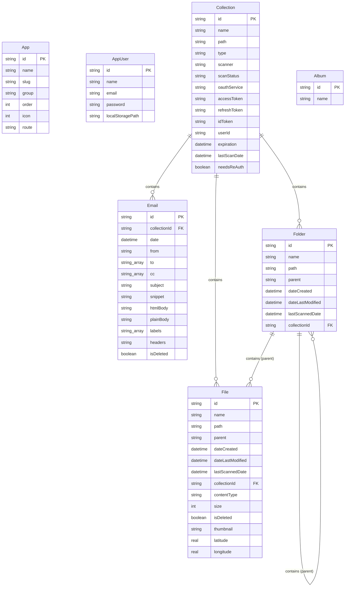

# MyData/Tools 

### Your personal data manager, organizer, and backup tool

MyData/Tools started with one idea - we need a way to keep a local copy of our online digital life. This includes cloud drives, emails, social media posts, and more. 

## Features

- **Local-first**: All data is stored locally on your device.
- **Privacy-focused**: No data is stored on our servers.
- **Cross-platform**: Works on Windows, macOS, and Linux.
- **Open-source**: Free and open-source software.

## Getting Started

### Prerequisites

- Flutter 3.0.0 or higher
- Dart 2.17.0 or higher

### Installation

1. Clone the repository:
   ```bash
   git clone https://github.com/mikenimer/mydatatools-desktop.git
   ```

2. Install dependencies:
   ```bash
   flutter pub get
   ```

3. Run the app:
   ```bash
    flutter run --dart-define-from-file=config/secrets.json
   ```

## License

This project is licensed under the Apache 2.0 License - see the [LICENSE](LICENSE) file for details.

## Contributing

Contributions are welcome! Please read the [CONTRIBUTING](CONTRIBUTING.md) file for details.

## Contact
[XDT Labs](mailto:mike@xdtlabs.com)

## Database Structure

The database is a SQLite database.

### Table Diagrams


